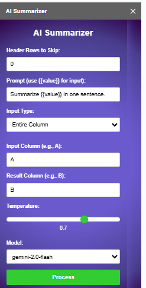
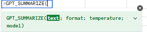

# AI-Powered-Translation-Plugin-for-Word-Processing-Applications

## Student information
**Name:** Nguyễn Hoàng Trung Kiên

**Student's ID:** 22127478

**Subject:** Natural Language Processing and Appplication

## 0. Introduction

This add-in integrates with Google Sheets, allowing you to process cell content using AI with customizable prompts.

**Platforms support:** Google Sheet

**Translation AI model used:** Gemini 2.0 Flash, Gemini 1.5 Flash.

## 1. Development Overview

Open **Google Sheet** and navigate to **Extensions > Apps Script**. In the **Apps Script editor**, write the backend logic in the `code.gs` file and create a `sidebar.html` file for the frontend interface. Once the coding process is complete, click **"Save"** button and select `onOpen()` and run.

Go back to your Google Docs file, and you'll see a new **"AI Summarizer"** menu in the toolbar. Click it and the add-in sidebar will appear. The excel calculation named `GPT_SUMMARIZE()` will also be available, enable users to process cells with AI.  

## 2. Usage guideline

Before running, make sure you paste the API key of Gemini 2.0 Flash in the code. For **Google Sheet**, add your Gemini API key to `code.gs` in **Apps Script editor**. 

## 2.1. Sidebar-Based User Interface

After opening the sidebar, you can see its UI:

**Options enable user to select:**

1. **Header Rows to Skip:** If your spreadsheet has header rows (like column titles), enter how many header rows to ignore.

2. **Prompt (AI Instruction):** Tell the AI what you want it to do by using {{value}} to represent the text you want summarized.

3. **Input Type:** How the data is picked:

- Row Range: Summarize a specific range of rows in a column.

- Single Cell: Summarize one specific cell.

- Entire Column: Summarize all rows of a column.

4. **Row Range Settings (Only visible if you choose "Row Range"):**
- Input Column: Which column the original text is in (e.g., A).

- Result Column: Where to save the AI summary (e.g., B).

- Row Selection: Auto or Fixed

5. **Single Cell Settings (Only visible if you choose "Single Cell"):**
- Input Cell: The specific cell to summarize (e.g., A2).

- Result Cell: Where the AI will write the summary (e.g., B2).

6. **Entire Column Settings (Only visible if you choose "Entire Column"):**
- Input Column: The column with the data to summarize.

- Result Column: The column to output the summaries.

7. **Temperature (Creativity Level):** Controls randomness and creativity of the AI output.

8. **Model Selection:** Choose which AI model you want to use. (Gemini 1.5/2.0 Flash)

After selecting all your options, click `Process` button.

## 2.2. GPT Function

The GPT function in this plugin named `GPT_SUMMARIZE`. It receives 4 inputs from user:

1. **Text:** The text or cell(s) that you want to process.

2. **Format:** The prompt for the AI that you expect to get the output.

3. **Temperature:** Controls randomness and creativity of the AI output.

4. **Model:** The AI model that you want to use. (Gemini 1.5/2.0 Flash)